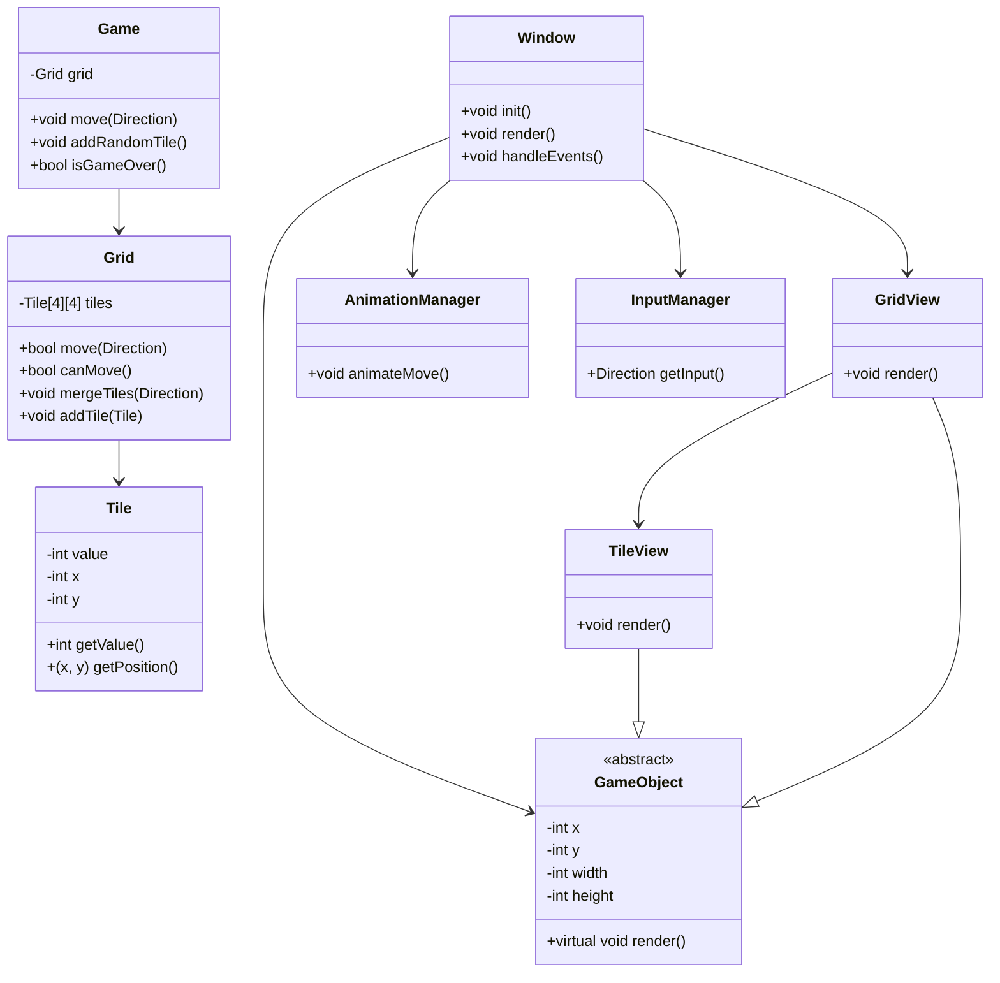

# 2048-tile-twister
Simple Tile Twister game in C++

## Arborescence du projet

```
2048-tile-twister/
│   main.cpp
│   README.md
│   LICENSE
├── include/
├── src/
│   ├── core/
│   │   ├── Game.h/.cpp
│   │   ├── Grid.h/.cpp
│   │   └── Tile.h/.cpp
│   └── sdl/
│       ├── Window.h/.cpp
│       ├── GameObject.h/.cpp
│       ├── TileView.h/.cpp
│       ├── GridView.h/.cpp
│       ├── AnimationManager.h/.cpp
│       └── InputManager.h/.cpp
```

## Diagramme de classes (Mermaid)


git push