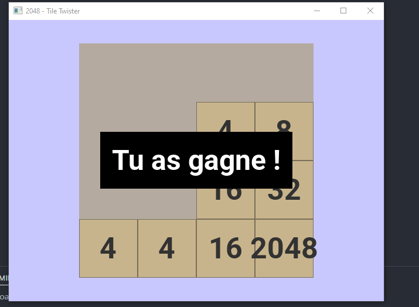
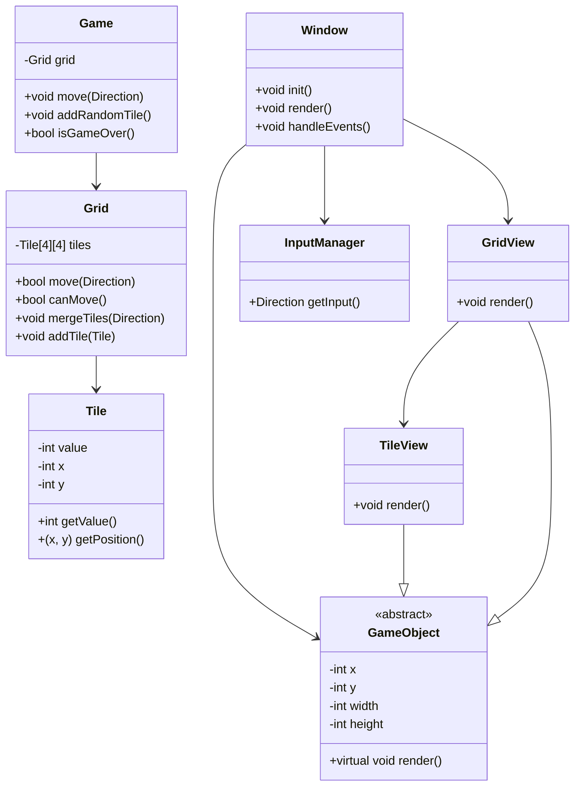
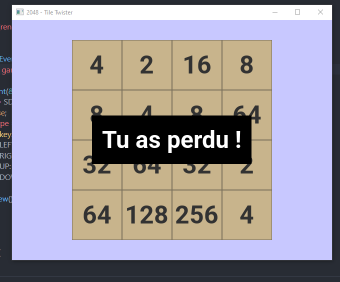

<div align="center">

# 🎮 2048 - Tile Twister

### A modern clone of the famous 2048 game

[](https://isocpp.org/)
[](https://www.libsdl.org/)
[](https://cmake.org/)
[](https://www.docker.com/)

[Installation](#-installation) •
[Usage](#-usage) •
[Architecture](#-architecture) •
[Roadmap](#-roadmap)



</div>

---

## ✨ Features

- 🎯 **Classic 4x4 grid** - Faithful reproduction of the original game
- ⌨️ **Intuitive controls** - Arrow keys to play
- 🎨 **SDL3 interface** - Smooth and modern rendering
- 🏆 **Win/Loss detection** - Real-time status messages
- 🐳 **Docker ready** - Simplified cross-platform compilation
- 🪟 **Windows support** - Native MinGW build

## 🚀 Installation

### Prerequisites

```bash
- Docker & Docker Compose
- CMake 3.15+
- SDL3 + SDL3_ttf
```

### Quick build

```bash
# Clone the repository
git clone https://github.com/your-username/2048-tile-twister.git
cd 2048-tile-twister

# Build with Docker
docker-compose up

# The executable is generated in ./build/
```

## 🎮 Usage

### Launch the game

```bash
./build/2048
```

### Controls

| Key    | Action            |
| ------ | ----------------- |
| ⬆️ `↑` | Move up           |
| ⬇️ `↓` | Move down         |
| ⬅️ `←` | Move left         |
| ➡️ `→` | Move right        |
| 🔄 `R` | Replay / New game |
| `ESC`  | Quit              |

### Game rules

1. Use arrow keys to move the tiles
2. Identical tiles merge when they touch
3. Create a **2048** tile to win! 🎉
4. No more possible moves = game over 😢

## 📁 Architecture

### Class diagram



### File tree

```
2048-tile-twister/
├── 📂 src/
│   ├── 📂 core/           # Business logic
│   │   ├── game.cpp       # Game manager
│   │   ├── grid.cpp       # Game grid
│   │   └── tile.cpp       # Individual tiles
│   ├── 📂 views/          # Graphical interface
│   │   ├── window.cpp     # Main window
│   │   ├── gridView.cpp   # Grid rendering
│   │   └── tileView.cpp   # Tile rendering
│   └── main.cpp           # Entry point
├── 📂 assets/
│   └── Roboto-Bold.ttf    # Display font
├── 🐳 Dockerfile
├── 📝 CMakeLists.txt
└── 📖 README.md
```

### Design Patterns

- **MVC**: Separation of core/views
- **Composition**: GameObject → TileView/GridView
- **Encapsulation**: Grid manages Tiles

## 🛠️ Technologies

<div align="center">

| Technology   | Usage              |
| ------------ | ------------------ |
| **C++17**    | Main language      |
| **SDL3**     | Graphics rendering |
| **SDL3_ttf** | Text display       |
| **CMake**    | Build system       |
| **Docker**   | Build environment  |

</div>

## 📊 Roadmap

- [x] Functional 4x4 grid
- [x] Movements and merges
- [x] Win detection (2048)
- [x] Loss detection (no more moves)
- [x] End game messages display
- [x] 🎯 "R" key to replay

## 🤝 Contribution

Contributions are welcome! Feel free to:

1. 🍴 Fork the project
2. 🔨 Create a branch (`git checkout -b feature/AmazingFeature`)
3. 💾 Commit your changes (`git commit -m 'Add AmazingFeature'`)
4. 📤 Push to the branch (`git push origin feature/AmazingFeature`)
5. 🎉 Open a Pull Request

## 📝 License

Distributed under the MIT License. See `LICENSE` for more information.

## 👤 Contributing

This project was made by:

- [Thibault Caron](https://github.com/thibault-caron)
- [Adeline Patenne](https://github.com/AdelinePat/)
- [Florence Navet](https://github.com/florence-navet)

---

<div align="center">



</div>  
  
---

Simple Tile Twister game in C++

In case you encounter error "build.sh" appear and you're on windows, launch this command to go from CRLF to LF (command on git bash!)

```bash
dos2unix build.sh
```

Create executable :

```bash
docker compose up windows --build
```

Execute executable

```bash
./build/2048.exe
```

##
